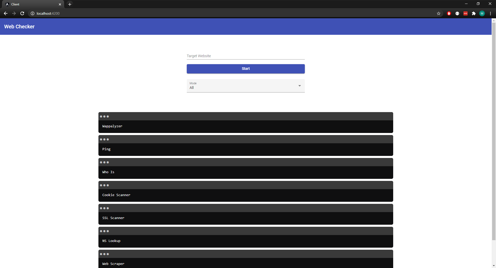
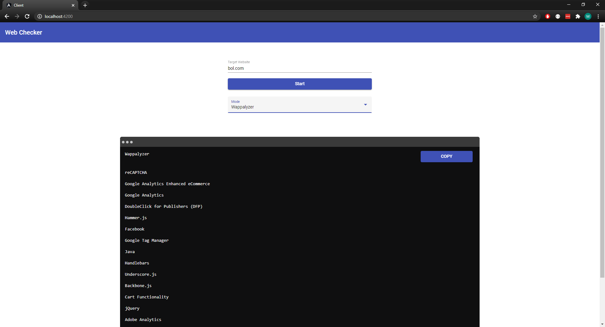
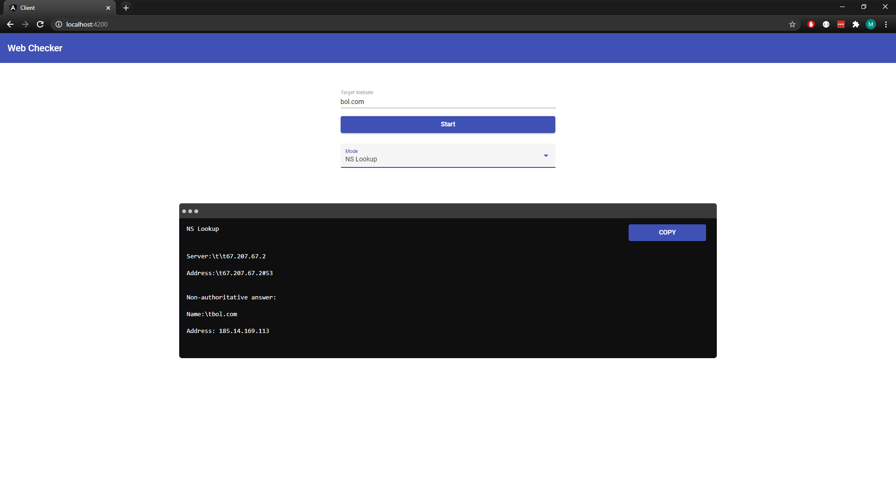
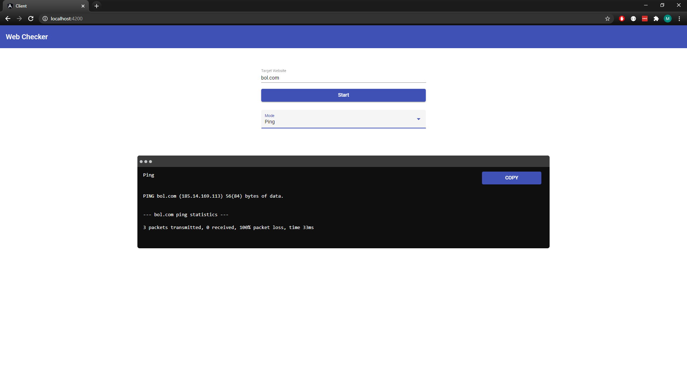
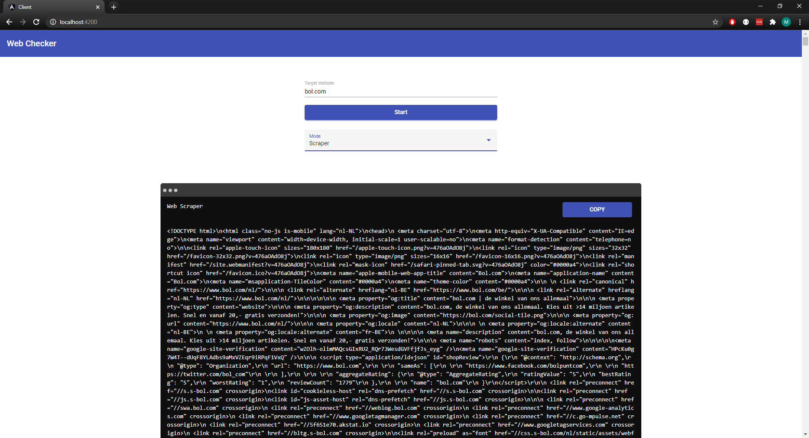
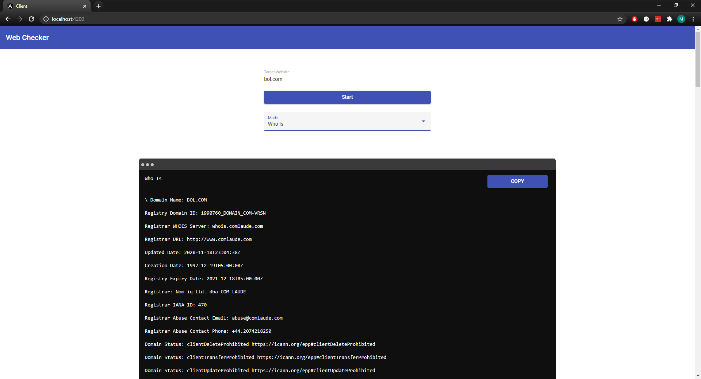
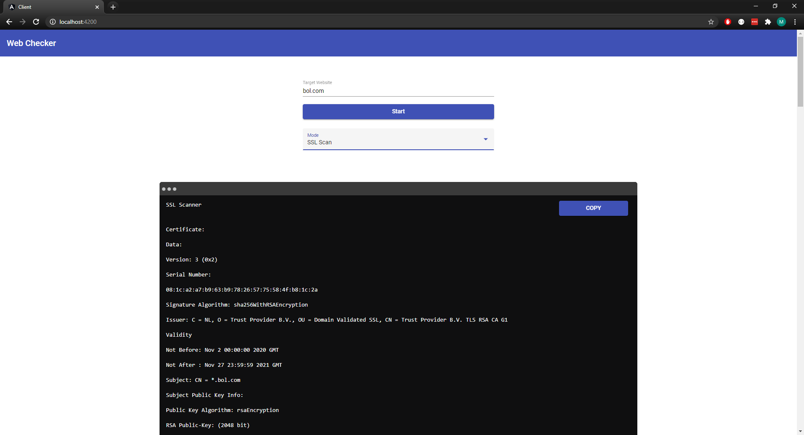

# Website-Checker
Web Checker passively collects information about another website

## Tools
* Wappalyzer
* Cookie Scanner
* Nslookup
* Ping
* Webscraper
* Whois
* SSL Scanner

## Extra
* Copy Button
* Mobile Version

## Preview
## Main
  
## Wappalyzer 
  
## Cookie Scanner 
  
## Nslookup
  
## Ping
  
## Webscraper
  
## Whois
  
## SSL Scanner
  
